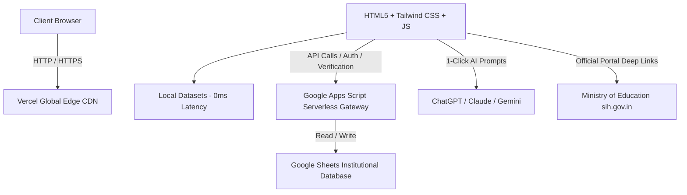

# 🏛️ Smart India Hackathon 2026 — United Institute of Technology (UIT Prayagraj)
### *Official Institutional Digital Archive, Results Engine & Conclave Platform*

[](https://sih-uit.vercel.app)
[](https://vercel.com)
[](https://tailwindcss.com)
[](https://developers.google.com/apps-script)
[](https://united.ac.in)

---

## 📌 Executive Overview

The **Smart India Hackathon 2026 College-Level Internal Hackathon Platform** is an institutional digital ecosystem designed, architected, and engineered for **United Institute of Technology (UIT), Prayagraj**.

Conducted on **22 August 2026**, the conclave brought together interdisciplinary innovators across Computer Science & Engineering, Artificial Intelligence & Machine Learning, Data Science, and Electronics to defend solutions before an 8-judge evaluation panel.

This digital platform serves as the **permanent, verified historical archive** preserving all records, student rosters, evaluation outcomes, digital certificates, and a live synchronization hub for the central **Ministry of Education / AICTE SIH 2026 National Portal**.

- 🔗 **Production URL:** [https://sih-uit.vercel.app](https://sih-uit.vercel.app)
- 📄 **Official Event Report:** [https://sih-uit.vercel.app/report.html](https://sih-uit.vercel.app/report.html)
- 🏆 **Selection Results (45+5):** [https://sih-uit.vercel.app/results.html](https://sih-uit.vercel.app/results.html)
- 🎤 **Presenting Teams (57):** [https://sih-uit.vercel.app/teams.html](https://sih-uit.vercel.app/teams.html)
- 💡 **Problem Statements Explorer (231 PS):** [https://sih-uit.vercel.app/problems.html](https://sih-uit.vercel.app/problems.html)

---

## ⚡ Conclave Vital Statistics

| Metric | Official Count | Details |
|---|---|---|
| **Registered Teams** | **73 Teams** | Roster verified through institutional portal |
| **Presented & Evaluated** | **57 Teams** | Physical presentations evaluated by 8 juries (Top 50 Selected: 45+5, 7 Not Selected) |
| **Verified Innovators** | **342 Students** | Interdisciplinary 6-member teams with female leadership representation |
| **Selected: Shortlisted** | **45 Teams** | Institutional nominations submitted to central Ministry of Education portal |
| **Selected: Waitlisted** | **5 Teams** | Merit standby quota ready to represent institutional slots |
| **Grand Jury Panel** | **8 Evaluators** | Senior academic leaders, domain experts & research faculty |
| **Official PS Repository** | **231 Statements** | 176 Software + 55 Hardware statements across 17 national themes |
| **Idea PPT Deadline** | **20 September 2026** | 4-slide national submission timeline |

---

## ✨ Key Platform Features

### 1. 🏆 Selection Results Engine (`results.html`)
- Dedicated showcase for the **Top 50 Selected Teams (45 Shortlisted + 5 Waitlisted)**.
- Real-time instant search by Team Name, Registration ID, Team Leader, or Project Title.
- Modal breakdown for every team showing individual scores across **Novelty (25%)**, **Feasibility (25%)**, **Prototype (25%)**, and **Defense (25%)**.
- Complete 6-member student roster display with branch, year, roll numbers, and official university enrollment IDs.

### 2. 🎤 Presenting Teams Archive (`teams.html`)
- Verified roster of all **57 student innovation teams** who completed their defense before the jury panels.
- Category filters: `All Presented (57)`, `🏆 Shortlisted (45)`, `⏳ Waitlisted (5)`, `🎤 Evaluated (7)`, and `📋 Unevaluated (16)`.
- Live roster verification badges and branch distribution indicators.

### 3. 💡 SIH 2026 Problem Statements Explorer (`problems.html`)
- Synchronized dataset of all **231 Official Problem Statements** from `sih.gov.in/sih2026PS`.
- **Instant Search & Thematic Filtering**: Filter across 17 national themes (Healthcare, AgriTech, Clean Energy, Disaster Management, Space, etc.) and Union Ministries.
- **1-Click AI Brainstorming Engine**: Generates customized, architect-grade prompts ready to paste into **ChatGPT**, **Claude**, or **Gemini** to brainstorm 4-slide Idea PPT structures, technical architectures, and feasibility defense.
- **Official SIH Portal Auto-Copy**: Native link that automatically copies the PS ID (e.g. `SIH26001`) to the clipboard so students can easily paste it into the official portal search.

### 4. 🔍 Digital Certificate Verification Portal (`verify.html`)
- Instant verification system for official institutional certificates.
- Search by Certificate ID, Student Roll Number, or Team Registration ID.
- Displays tamper-proof accreditation metadata including team rank, category, and evaluation dates.

### 5. 📸 High-Resolution Conclave Gallery (`gallery.html`)
- Curated visual archive of presentations, jury evaluations, lab sessions, and thanksgiving ceremonies.
- Category tabs: `All`, `Inauguration`, `Presentations`, `Jury Evaluation`, `Student Innovators`.
- Integrated responsive image viewer with keyboard navigation and instant image zoom.

### 6. 📄 Official Institutional Event Report (`report.html`)
- Comprehensive formal document adhering to institutional documentation standards (`UIT/CSE/SIH-2026/REP-001`).
- Includes Executive Summary, Conclave Objectives, Evaluation Methodology, Quota Analysis, and Thanksgiving Acknowledgments.
- Built-in `Print / Save as PDF` CSS styling optimized for A4 archiving.

### 7. 🔐 Student Portal & Serverless Backend (`portal.html`, `portal-dashboard.html`)
- Google Apps Script backend integrating Google Sheets as a high-availability relational datastore.
- Secure team login with automated password dispatch, registration recovery, and submission status tracking.

---

## 🛠️ Architecture & Tech Stack



### **Frontend:**
- **Markup & Styling:** Semantic HTML5, [Tailwind CSS 3](https://tailwindcss.com), Custom CSS variables for institutional branding.
- **Typography:** *Plus Jakarta Sans*, *Space Grotesk*, and *JetBrains Mono* (via Google Fonts).
- **Zero-Dependency Core:** High-speed vanilla JavaScript with zero heavy framework overhead for instant mobile loading.

### **Backend & Datastore:**
- **Serverless API:** Google Apps Script (`google-apps-script/Code.gs`) providing secure JSON REST endpoints.
- **Database:** Google Sheets with structured tables for Teams, Jury Scoresheets, Certificate Ledgers, and Login Credentials.
- **Hosting & CDN:** [Vercel](https://vercel.com) global edge deployment with automated production pipelines.

---

## 📁 Repository Directory Structure

```text
SIH-UIT/
├── assets/                          # Institutional graphics, brand logos & template downloads
│   ├── gallery/                     # High-resolution conclave photographs (DSC_xxxx.JPG)
│   ├── united-logo.png              # UIT Institutional emblem
│   ├── SIH2026-IDEA-Presentation-Format.pptx # Official 4-slide national template
│   └── sih-2026-guidelines.pdf      # Central Ministry of Education guidelines
├── css/
│   └── styles.css                   # Custom utility classes, animations & print media stylesheets
├── js/
│   ├── api.js                       # Client API gateway with fallback caching
│   ├── countdown.js                 # Live submission countdown timers
│   ├── receipt.js                   # Certificate and acknowledgement generator
│   ├── validation.js                # Input validators for registration & search
│   └── data/
│       ├── presenting-teams.js      # 57 Evaluated Teams (45 Shortlisted + 5 Waitlisted + 7 Not Selected)
│       ├── results-data.js          # 45 Shortlisted + 5 Waitlisted teams evaluation records
│       └── sih-problem-statements.js# 231 Official national problem statements dataset
├── google-apps-script/
│   └── Code.gs                      # Serverless backend endpoints for Google Apps Script
├── docs/                            # Conclave documentation & reference materials
├── index.html                       # Conclave Digital Archive Homepage
├── results.html                     # Top 50 Selected Teams (45 Nominated + 5 Waitlisted)
├── teams.html                       # Presenting Teams Archive (57 Teams Evaluated)
├── problems.html                    # Official SIH 2026 Problem Statement Explorer (231 PS)
├── judges.html                      # Grand Jury Evaluation Panel & Faculty Leaders
├── gallery.html                     # Conclave Visual Archive & Media Showcase
├── report.html                      # Formal Institutional Event Report (Print-Ready)
├── verify.html                      # Digital Certificate Verification Gateway
├── portal.html                      # Team Leader Authentication Portal
├── portal-dashboard.html            # Student Submission & Verification Dashboard
├── portal-forgot.html               # Automated Password Recovery Portal
├── sync_sih_ps.js                   # Node.js synchronization scraper for sih.gov.in
├── README.md                        # Platform documentation (this file)
└── .vercelignore                    # Vercel deployment exclusions
```

---

## 🚀 Local Development Setup

To run this repository locally on your machine:

1. **Clone the repository:**
   ```bash
   git clone https://github.com/gkm563/SIH-UIT.git
   cd SIH-UIT
   ```

2. **Serve using any static web server:**
   - Using VS Code: Right-click `index.html` and select **"Open with Live Server"**.
   - Using Python:
     ```bash
     python -m http.server 3000
     ```
   - Using Node `serve` or `npx`:
     ```bash
     npx serve .
     ```

3. **Open in browser:**
   Navigate to `http://localhost:3000` to browse the platform.

---

## 🏛️ Conclave Leadership & Institutional Credits

### **Institutional Patrons & Faculty Guidance**
- **Prof. Sanjay Srivastava** — Principal, United Institute of Technology, Prayagraj
- **Dr. Dhananjay Kumar Sharma** — SPOC & Convener (SIH 2026) | Head, Department of CSE (AIML & DS)
- **Dr. Manas Pandey** — Dean Student Welfare (DSW), United Institute of Technology
- **Mr. Gaurav Narain Singh** — Faculty Coordinator, Department of CSE
- **Mr. Kushagra Dwivedi** — Faculty Coordinator, Department of CSE

### **Student Organizing Leadership & Operations**
- **Gautam Kumar Maurya (GKM)** — Lead Student Coordinator | Head, Developers Club, UIT *(System Architect & Full-Stack Developer)*
- **Harsh Srivastava** — Student Coordinator (Operations, Venue & Jury Logistics)
- **Student Jury Operations Crew:** Abhinav Tiwari, Amit Dubey, Prabhat Pandey, Abhi, Praveen, Ayush Singh, Rohit Pal, and Yash Singh.

---

## 📜 License & Copyright

© **2026 Department of Computer Science & Engineering, United Institute of Technology, Prayagraj.**  
All institutional records, team submissions, scoring rubrics, and conclave documentation are preserved permanently under the authority of the **Internal Hackathon Organizing Committee & SPOC Office**.

*Designed, Developed & Preserved by [Gautam Kumar Maurya (GKM)](https://www.linkedin.com/in/gkm563/).*
