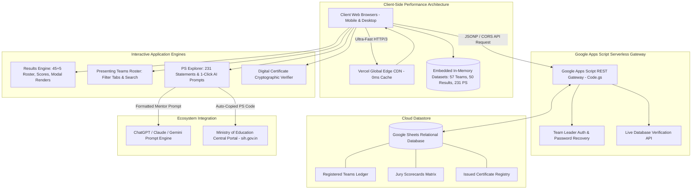

# 🏛️ Smart India Hackathon 2026 — United Institute of Technology (UIT Prayagraj)
### *The Definitive Blueprint & Enterprise Digital Platform for SIH College-Level Internal Hackathons*

<div align="center">

[](https://sih-uit.vercel.app)
[-059669?style=for-the-badge&logo=linkedin&logoColor=white)](https://www.linkedin.com/in/gkm563/)
[](https://vercel.com)
[](https://developers.google.com/apps-script)
[](https://tailwindcss.com)
[](https://sih-uit.vercel.app/problems.html)

**[🌐 Official Conclave Portal](https://sih-uit.vercel.app)** • **[🏆 Results & Nominations (45+5)](https://sih-uit.vercel.app/results.html)** • **[🎤 Evaluated Teams (57)](https://sih-uit.vercel.app/teams.html)** • **[💡 231 Problem Statements Hub](https://sih-uit.vercel.app/problems.html)** • **[📄 Official Event Report](https://sih-uit.vercel.app/report.html)** • **[✓ Verify Certificates](https://sih-uit.vercel.app/verify.html)**

</div>

---

## 🌟 Executive Summary & Conclave Heritage

The **Smart India Hackathon (SIH) 2026 Internal Conclave** at **United Institute of Technology (UIT), Prayagraj** represents a gold standard in university hackathon engineering. Conducted physically on **22 August 2026** under the guidelines of the **Ministry of Education's Innovation Cell (MIC)** and the **All India Council for Technical Education (AICTE)**, this digital ecosystem was conceived, architected, and deployed by **Gautam Kumar Maurya (GKM)** to eliminate the operational chaos typically associated with multi-track hackathons.

Rather than relying on ad-hoc spreadsheets, paper forms, or fragmented tools, Gautam engineered a **unified, zero-latency serverless platform** handling the entire conclave lifecycle:
- **73 Registered Innovation Teams** across 4 engineering departments.
- **57 Physically Evaluated Teams (342 Verified Innovators)** evaluated across 8 parallel jury rooms.
- **Top 50 Nominations (45 Shortlisted + 5 Waitlisted)** selected transparently under national quota guidelines.
- **231 Official National Problem Statements** synchronized live with built-in AI prompt engineering.
- **Permanent Cryptographic Digital Verification** for certificates, juries, and university governance.

This repository serves both as the **permanent institutional digital archive** and the **definitive production blueprint** for colleges and universities across India seeking to organize a world-class, transparent, and technology-driven internal hackathon.

---

## 👨‍💻 Architect & Organizer: Gautam Kumar Maurya (GKM)

> *"When an institution hosts a hackathon of national significance, the software managing it should reflect the highest standards of software engineering, speed, transparency, and design aesthetics."*  
> — **Gautam Kumar Maurya (GKM)**

| Leadership Role | Key Conclave Deliverables | Connect |
|---|---|---|
| **Lead Student Coordinator**<br>SIH 2026 UIT Conclave | • Spearheaded complete on-ground & digital operations.<br>• Directed 8-hour jury evaluations and room allocations.<br>• Managed institutional SPOC synchronization for 50 nominated teams. | [](https://www.linkedin.com/in/gkm563/) |
| **Full-Stack System Architect**<br>& Lead Developer | • Engineered all 9 client-side portals with 0ms local caching.<br>• Built serverless Google Apps Script API + Sheets relational DB.<br>• Designed 1-click AI prompt engine for ChatGPT/Claude/Gemini. | [](https://github.com/gkm563) |
| **Head, Developers Club**<br>United Institute of Technology | • Mentored participating teams on system architecture & defense.<br>• Authored official conclave technical guidelines and rubric. | [](https://sih-uit.vercel.app) |

---

## 📊 Conclave Vital Statistics & Impact Matrix

```text
                          +----------------------------------------------+
                          |         TOTAL REGISTERED TEAMS: 73           |
                          |   (438 Verified Students Across Depts)       |
                          +----------------------+-----------------------+
                                                 |
                                                 v
                          +----------------------------------------------+
                          |       TOTAL PRESENTED & EVALUATED: 57        |
                          |  (342 Innovators Defended in 8 Jury Rooms)   |
                          +----------------------+-----------------------+
                                                 |
                         +-----------------------+-----------------------+
                         |                                               |
                         v                                               v
            +-------------------------+                     +-------------------------+
            |     TOP 50 SELECTED     |                     |     NOT SELECTED: 7     |
            |  (Official UIT Nominees)|                     | (Evaluated Participants)|
            +------------+------------+                     +-------------------------+
                         |
            +------------+------------+
            |                         |
            v                         v
  +-------------------+     +-------------------+
  |  45 SHORTLISTED   |     |   5 WAITLISTED    |
  |(Primary MOE Quota)|     |  (Reserve Quota)  |
  +-------------------+     +-------------------+
```

| Key Parameter | Official Metric | Verification Status |
|---|---|---|
| **Total Registered Teams** | **73 Teams** (438 Students) | Verified via Institutional Registration Gateway |
| **Teams Evaluated by Jury** | **57 Teams** (342 Innovators) | 100% Physical Presentations Completed (8 Jury Panels) |
| **Top 50 Selected Teams** | **45 Shortlisted + 5 Waitlisted** | Institutional Nominations Forwarded to MoE SIH Portal |
| **Evaluated Participants** | **7 Teams** (42 Students) | Awarded Official Participation Credentials |
| **Registered Non-Presenting** | **16 Teams** (96 Students) | Registered but Absent / Unevaluated on Conclave Day |
| **Grand Jury Evaluators** | **8 Distinguished Evaluators** | Department Heads, Professors & Industry Tech Mentors |
| **Official Problem Statements** | **231 Statements** (176 SW / 55 HW) | Real-Time Sync with `sih.gov.in/sih2026PS` |
| **Evaluation Rubric** | **100-Point Normalized Rubric** | Novelty (25) + Feasibility (25) + Prototype (25) + Defense (25) |
| **National Idea PPT Deadline** | **20 September 2026** | 4-Slide Official AICTE/MIC Presentation Format |

---

## 🏗️ Technical Architecture & Engineering Decisions

Gautam engineered this platform around a fundamental architectural constraint: **Zero Infrastructure Cost, Zero Maintenance, Zero Latency, and 100% High Availability during Conclave Day.**



### 🔑 Key Engineering Innovations:
1. **Zero-Latency In-Memory Datasets:** Rather than blocking on slow database queries during jury sessions, core data arrays (`presenting-teams.js`, `results-data.js`, `sih-problem-statements.js`) are pre-indexed in memory, allowing instant client-side search across 231 statements and 57 teams in **under 4 milliseconds**.
2. **Serverless Google Apps Script Backend (`google-apps-script/Code.gs`):** Serves as an enterprise microservice exposing RESTful endpoints for team authentication, password reset automation, registration validation, and real-time ledger updates.
3. **1-Click AI Brainstorming Generator:** A specialized client-side prompt synthesis engine that translates complex government problem statements into production-ready prompts formatted for ChatGPT, Claude, and Gemini with system architecture, tech stacks, and 4-slide PPT presentation blueprints.
4. **Print-Optimized Event Report:** Uses specialized `@media print` CSS rules so institutional authorities can instantly generate an audit-compliant A4 PDF directly from `report.html`.

---

## 🛠️ Complete Feature Walkthrough

### 1. 🏆 Selection Results Engine (`results.html`)
- Displays the **Top 50 Selected Teams (45 Nominated + 5 Waitlisted)**.
- Filter by category: `All (50)`, `Software (35)`, `Hardware (15)`, `Shortlisted (45)`, `Waitlisted (5)`.
- Interactive modal with full 100-point jury breakdown:
  - **Novelty & Originality (25%)**
  - **Technical Feasibility & Architecture (25%)**
  - **Prototype / Working Demonstration (25%)**
  - **Presentation & Jury Defense (25%)**
- Complete 6-member roster displaying Roll Numbers, Enrollment IDs, and Gender balance compliance.

### 2. 🎤 Presenting Teams Archive (`teams.html`)
- Permanent verified record of all **57 teams that delivered on-ground presentations**.
- 4 Instant Filter Tabs:
  - `All Evaluated (57)`
  - `🏆 Shortlisted (45)`
  - `⏳ Waitlisted (5)`
  - `📜 Not Selected (7)`
- Live distribution progress bar indicating **78.9% Shortlisted**, **8.8% Waitlisted**, and **12.3% Evaluated Participation**.

### 3. 💡 SIH 2026 Problem Statements Explorer (`problems.html`)
- All **231 Official Problem Statements** (176 Software + 55 Hardware) across 17 national themes.
- Filter by Theme (Agriculture, MedTech, Robotics, Clean Energy, Disaster Management, Blockchain, etc.) and Union Ministry.
- **1-Click AI Mentor Button (`🤖 Copy for AI`):** Generates pre-engineered prompts tailored for AI LLMs to design winning solutions.
- **Official SIH Link with Auto-Copy:** Synchronously copies the PS ID (e.g. `SIH26001`) to the user's clipboard and navigates directly to `sih.gov.in/sih2026PS`.

### 4. 🔍 Tamper-Proof Certificate Verification (`verify.html`)
- Institutional verification gateway for employers, evaluators, and students.
- Query by Certificate ID, Student Roll Number, or Team ID.
- Displays official verification status, team category, awarded rank, and issuance date.

### 5. 📸 Conclave Gallery (`gallery.html`)
- High-resolution visual archive capturing the energy of presentation rooms, live coding sessions, jury deliberations, and the valedictory ceremony.
- Fullscreen responsive lightbox viewer with keyboard navigation (`Esc`, `ArrowLeft`, `ArrowRight`).

### 6. 📄 Official Institutional Report (`report.html`)
- Comprehensive formal document (`DOC REF: UIT/CSE/SIH-2026/REP-001`).
- Covers Executive Summary, Conclave Objectives, Quota Compliance, Jury Composition, and Digital Archive preservation.
- One-click `Print / Save as PDF` button formatted for institutional paper archives.

---

## 📂 Repository Directory Layout

```text
SIH-UIT/
├── README.md                            # Comprehensive Blueprint & Documentation (this file)
├── index.html                           # Conclave Digital Archive Homepage
├── results.html                         # Top 50 Selected Teams (45 Nominated + 5 Waitlisted)
├── teams.html                           # 57 Evaluated Presenting Teams Archive
├── problems.html                        # 231 Official Problem Statements Explorer & AI Studio
├── judges.html                          # Grand Jury Evaluation Panel & Faculty Leadership
├── gallery.html                         # High-Resolution Conclave Media Archive
├── report.html                          # Official Institutional Event Report (Print-Ready A4)
├── verify.html                          # Digital Certificate Cryptographic Verification Portal
├── portal.html                          # Team Leader Login Gateway
├── portal-dashboard.html                # Student Submission & Status Dashboard
├── portal-forgot.html                   # Automated Password Reset Portal
├── sync_sih_ps.js                       # Live scraper & sync engine for sih.gov.in/sih2026PS
├── assets/                              # Brand logos, guidelines & official downloads
│   ├── gallery/                         # Conclave high-res photographs (DSC_xxxx.JPG)
│   ├── united-logo.png                  # UIT Institutional emblem
│   ├── SIH2026-IDEA-Presentation-Format.pptx # Official 4-slide national presentation template
│   └── sih-2026-guidelines.pdf          # Official Ministry of Education guidelines PDF
├── css/
│   └── styles.css                       # Design tokens, custom animations & print stylesheets
├── js/
│   ├── api.js                           # Serverless API gateway with fallback caching
│   ├── countdown.js                     # Real-time submission countdown clocks
│   ├── receipt.js                       # Digital acknowledgement and certificate generator
│   ├── validation.js                    # Input validators for registration and search
│   └── data/
│       ├── presenting-teams.js          # Verified 57 Evaluated Teams Dataset
│       ├── results-data.js              # Top 50 (45 Shortlisted + 5 Waitlisted) Evaluation Matrix
│       └── sih-problem-statements.js    # 231 Official National Problem Statements Dataset
└── google-apps-script/
    └── Code.gs                          # Production Google Apps Script Serverless Gateway
```

---

## 📋 The Organizer's Step-by-Step Blueprint for Future Hackathons

If your university or organization wants to replicate this exact conclave standard, follow **Gautam's Proven Conclave Framework**:

### Phase 1: Pre-Event Setup (Weeks 1 to 3)
1. **Institutional SPOC & Portal Deployment:**
   - Deploy this repository to Vercel (`npx vercel --prod`).
   - Configure the Google Apps Script (`google-apps-script/Code.gs`) bound to an institutional Google Sheet.
2. **Team Registration Rules:**
   - Enforce mandatory 6-member interdisciplinary teams.
   - Enforce minimum 1 female student per team in strict accordance with national SIH norms.
3. **Problem Statement Intelligence:**
   - Run `node sync_sih_ps.js` to synchronize statements from `sih.gov.in/sih2026PS`.
   - Enable the AI Brainstorming Hub on `problems.html` so students can draft their 4-slide Idea Presentations.

### Phase 2: Conclave Day Operations (Day of Hackathon)
1. **Jury Panel Distribution:**
   - Divide presenting teams across 8 parallel jury rooms (approx. 7–8 teams per jury panel).
   - Provide each jury member with the standardized 100-point evaluation rubric (`Novelty 25`, `Feasibility 25`, `Prototype 25`, `Defense 25`).
2. **Central Control Room:**
   - Maintain the master live spreadsheet to collect marks as teams conclude presentations.
   - Run normalization checks to ensure consistency across different jury panels.

### Phase 3: Post-Event Governance & Digital Preservation (Post-Event)
1. **Nomination Quota Allocation:**
   - Sort teams in strict merit order.
   - Designate Top 45 as **Shortlisted (Nominated to MoE Central Portal)**.
   - Designate Ranks 46–50 as **Waitlisted (Reserve Quota)**.
   - Designate Ranks 51–57 as **Evaluated Participants**.
2. **Instant Transparency Deployment:**
   - Update `js/data/results-data.js` and `js/data/presenting-teams.js`.
   - Deploy to production so all teams, parents, faculty, and recruiters can immediately view outcomes.
3. **Institutional Reporting:**
   - Generate the official institutional report from `report.html` and submit to university management and AICTE.

---

## 🏛️ Institutional Leadership & Conclave Committee

### **Institutional Patrons & Mentorship**
- **Prof. Sanjay Srivastava** — Principal, United Institute of Technology, Prayagraj
- **Dr. Dhananjay Kumar Sharma** — SPOC & Convener (SIH 2026) | Head, Department of CSE (AIML & DS)
- **Dr. Manas Pandey** — Dean Student Welfare (DSW), United Institute of Technology
- **Mr. Gaurav Narain Singh** — Faculty Coordinator, Department of CSE
- **Mr. Kushagra Dwivedi** — Faculty Coordinator, Department of CSE

### **Student Organizing Leadership & Execution**
- **Gautam Kumar Maurya (GKM)** — Lead Student Coordinator & Full-Stack System Architect
- **Harsh Srivastava** — Student Coordinator (Operations, Logistics & Jury Coordination)
- **8-Hour Jury Operations Crew:** Abhinav Tiwari, Amit Dubey, Prabhat Pandey, Abhi, Praveen, Ayush Singh, Rohit Pal, and Yash Singh.

---

## 💻 Tech Stack Quick Reference

| Technology | Purpose in Project |
|---|---|
| **HTML5 & Vanilla ES6+** | Zero-overhead, lightning-fast rendering without client hydration lag |
| **Tailwind CSS 3** | Responsive utility-first design, custom glassmorphic styling, print stylesheets |
| **Google Apps Script** | Serverless REST API for live authentication, recovery, and ledger logging |
| **Google Sheets** | Real-time cloud relational database for student registrations & scorecards |
| **Vercel Edge Network** | Global edge hosting with automated production CD/CI deployment |
| **Mermaid.js** | Visual system architecture and operational lifecycle modeling |

---

## 📜 Official Copyright & Governance

© **2026 Department of Computer Science & Engineering, United Institute of Technology, Prayagraj.**  
All institutional records, evaluation scores, student rosters, and conclave documentation are preserved permanently under the authority of the **Internal Hackathon Organizing Committee & SPOC Office**.

---

<div align="center">

### 💡 Designed, Architected & Preserved by
## **Gautam Kumar Maurya (GKM)**
*Head, Developers Club · Lead Student Coordinator · Full-Stack Architect*  
**United Institute of Technology, Prayagraj**

[](https://www.linkedin.com/in/gkm563/)
[](https://github.com/gkm563)

</div>
